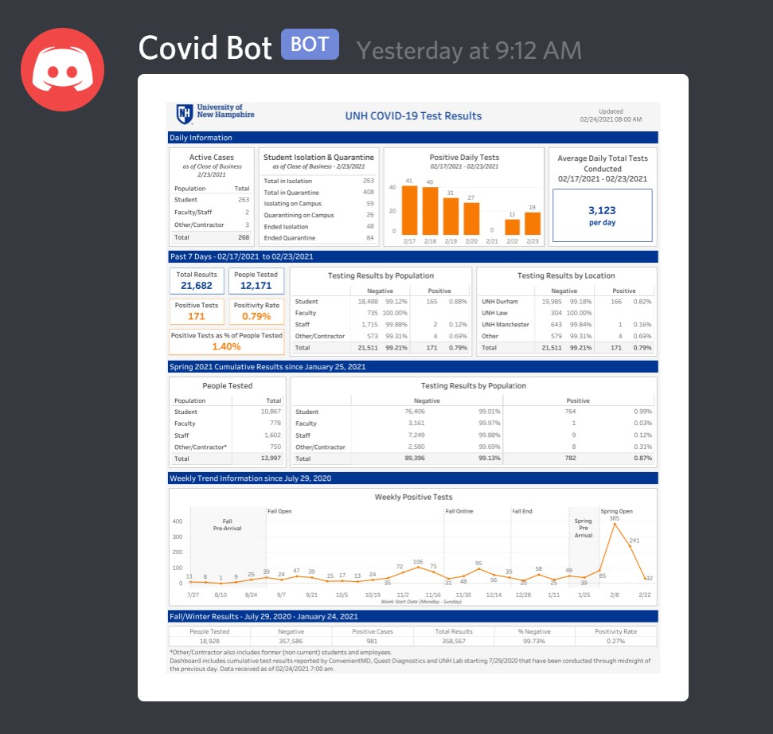

# covid-bot
A discord bot that uploads UNH Covid testing results every weekday as they are released.

---

Pretty simple and thrown-together bot to grab the pdf from the [UNH Covid-19 Dashboard](https://www.unh.edu/coronavirus/dashboard), convert it to a png locally and reupload to all servers activated in the config file.

Updates look like this:
 

It's nothing too fancy, but it gets the job done and helps keep everyone informed.